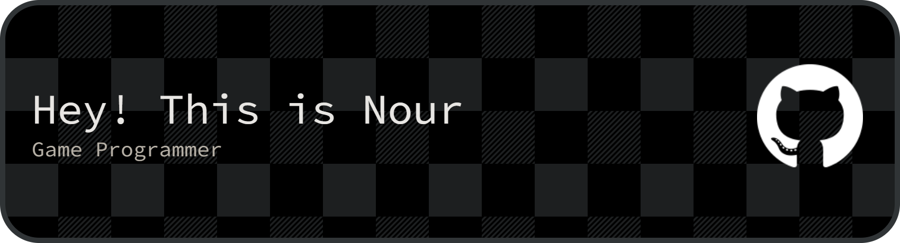

# My-Profile

<h1 align="center">Hi 👋, I'm Nour</h1>
<h3 align="center">A Game Programmer from Tunisia</h3>

- 🌱 I’m currently learning **c++ in UE5 an Procedural Generation**

- 📚 I’m currently reading [The Unity Shaders Bible](https://jettelly.com/store/the-unity-shaders-bible)

- 📫 How to reach me **nour0ltaief@gmail.com**

- 📄 Know about my experiences [Download my résumé ](https://drive.google.com/uc?export=download&id=1aGGSletd0SQ4SIMdq9l_f5aPDpZjCbH2)

<h3 align="left">Connect with me:</h3>

<h3 align="left">Languages and Tools:</h3>

#### Programming Languages

#### Game Development

#### Web Development

#### Design Tools

 
 
